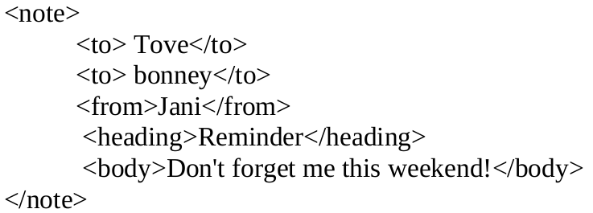
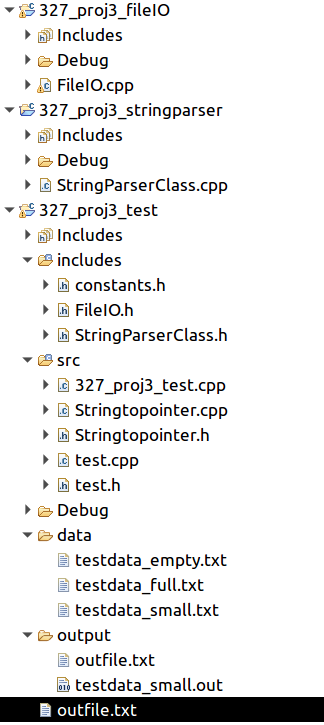
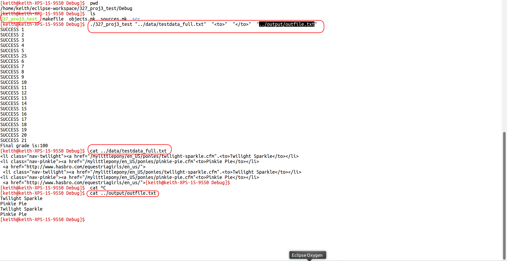

**CPSC 327\
**


**Teams:** None, please work individually on this project

**Name:** Static Libraries, Simple Classes, Command line arguments,
Pointers, String Parsing

**References**:

1.  Building and linking to a Static Library lectures and projects

2.  Pointers Memory lectures and projects

3.  Classes, Objects lectures and projects

**Sample Code:**

See 3 starter projects

327_proj3_test

327_proj3_stringparser

327_proj3_fileIO


**Topics covered by this project;**

-   Creating and using a static library

-   Using pointers to manipulate char data

-   Namespaces

-   Classes (intro)

-   Command Line Arguments

-   vectors

    **String Parser**

    A string parser is an application that takes a block of text and
    extracts the string residing between 2 user defined tags. If these
    tags occur multiple times in the text, then the parser extracts
    multiple strings.

For instance assume TestData.txt contains the following data;



And my Start and End Tags are \<to> and \</to>. The StringParser library
should find

Tove

bonney

A string parser design should be flexible in that it should be able to
use any Start and End Tag.

**Library**

The string parser is so versatile that it should be packaged in a
library so that it can be easily integrated into other applications.
This approach has the following advantages;

1.  Easy to integrate into multiple projects.

2.  Easy to maintain. Any changes made to the parser library are made in
    a single codebase regardless of the number of applications using it.
    (There are not multiple copies of the parser source code embedded in
    client applications, each requiring individual attention when
    integrating parser changes.)

3.  It makes it easier to divvy up projects in a team. The library is
    defined by its interface, in this case a header file that describes
    the functionality it provides. The header file is a contract
    describing library functions, how they are accessed, what is
    returned, and what is expected. It completely defines all
    communication possibilities between the library and its clients.

For these 3 reasons alone (there are more) much of the code produced in
the world is provided as a library.

**What I gave you**

On the course website, projects section, you will find 3 incomplete
projects. The following shows the solution as it appears in Eclipse. The
includes directory should be in a top level stand alone folder, but we
are running up against a limitation of eclipses' 'Workspace' concept. So
it's located in the 327_proj3_test folder. Note that FileIO.h and
StringParserClass.h as well as constants.h are located there.



**Assignment**

This project links 327_proj3_fileIO Library correctly to the
327_proj3_Test application. Please implement the 327_proj3_StringParser
library and link it to the 327_proj3_Test application.

Please fill in all required content in;

-   FileIO.cpp

-   StringParserClass.cpp

Note that 327_proj3_test.cpp requires command line parameters to be
passed in when the program is invoked, there should be 4 of them;

-   the first is the filename to read data from

-   the second is the first tag to search for

-   the third is the second tag to search for

-   and the fourth is the output file to write all the found data to

see below for sample run



When finished StringParser_TEST will link 2 libraries StringParser.lib
and FileReader.lib

**Requirements**

-   Please fork then clone these 3 projects in gitlab. Please submit all
    your work on gitlab. I am primarily going to test the following
    files from your gitlab repository.

FileIO.cpp

StringParserClass.cpp

-   Please ensure that you parse the text using char pointers, no
    algorithms or built in string parsing are allowed. Raw pointers
    only. You may save the parsed strings in a vector however.

**Stuff to consider**

-   Follow my project outline

-   **Read ref 1**

-   I have provided the header files that serve as library contracts.
    You cannot change the header file at all! I will use my copy of this
    header file when linking to your library. Please implement all
    functions defined in the header file. You are of course able to
    implement other functions in the cpp file.

-   Tags cannot be embedded within tags

-   Read all the data from the file before you operate on it

-   Tags are case sensitive \<To> != \<TO>

```{=html}
<!-- -->
```
-   What happens if no start or end tags are found?

-   What if tags are malformed and right at the end of the file? Will
    your app read beyond the EOF and crash?

-   If you change the header file that will break the contract between
    my testapp and your library, I may not be able to test it. Since I
    am using my copy of the library header files your application may
    also not compile either.

-   See FileIO.h and StringParserClass.h (the contracts I've been going
    on about)

-   See 327_proj3_Test project and examine its linkage to
    327_proj3_fileIO

**How I will Test your Solution**

I will compile and link your solution. I will probably use my own
datasets to test regular and edge conditions.
