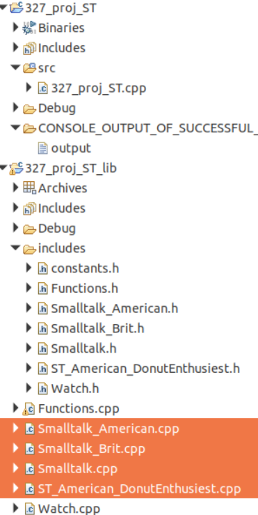
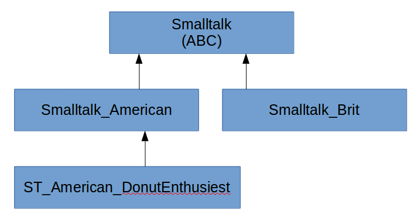
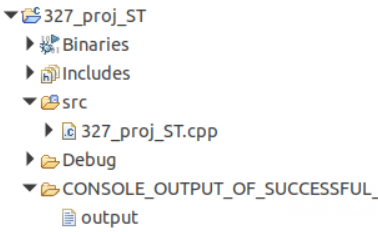
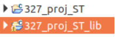

**CPSC 327**

**Project\
**

**Teams:** None, please work individually on this project

**References**:

1.  Building and linking to a Static Library lectures and projects

2.  Pointers Memory lectures and projects

3.  Classes, Objects lectures and projects

**Sample Code:**

See 2 starter projects

**Topics covered by this project;**

-   Creating and using a static library

-   Using pointers to manipulate objects

-   Using vectors to hold objects and pointers

-   Class Heiarchies

-   Abstract Base Classes

-   Polymorphism

-   Composition

    **Class Heiarchy**

    You are developing a class hierarchy for this project. An Abstract
    Base Class (ABC), 'Smalltalk' defines the hierarchy behavior. Most
    of your work in this class structure will take place in Smalltalk.

    Classes derived from Smalltalk must implement populatePhrases(). A
    function that initializes the baseclass vector with phrases that are
    unique to that class type. For instance, Smalltalk_American will
    populate its internal vector of strings with the american phrases
    found in constants.h.

    Additionally you are given a complete watch object. You may give or
    take a watch from any instance of Smalltalk_American,
    ST_American_DonutEnthusiest or Smalltalk_Brit. Note that watches
    cannot be created out of thin air, if you give one to an instance
    you no longer have that watch, the instance does. See Smalltalk.h
    for further guidance.

    Please also provide a function (as specifies in Functions.h and
    outlined in Functions.cpp) that generates a vector of unique
    pointers to objects derived from smalltalk. Please pay attention to
    the hints I've left you in the implementation.

    Please compile both projects using the C++11 language standard.

**Library**

I would like you to fill in noted content in the following project
structure.

Note the file 'output' under CONSOLE_OUTPUT_OF_SUCCESSFUL... It has a
listing of what a successful run should look like.

All classes inherit publicly. The class hierarchy is as follows;

I have given you the header files and some of the implementation.

**Testing**

Please see the test application with the following name and file
structure:

327_Proj_ST.cpp is a complete tester for the classes and functions you
develop in the lib. This application should link statically to the above
library. The projects as they appear in the eclipse workspace.

**Submission:**

Please fork this projct to your GitLab account.  Then clone to your local machine.  Please commit all changes to your fork in GitLab.To grade, I will pull your Gitlab repository and evaluate the following 5 files only. 

Functions.cpp

Smalltalk_American.cpp

Smalltalk_Brit.cpp

Smalltalk.cpp

ST_American_DonutEnthusiest.cpp

**Grading**:

For each concrete class remember to push as much common functionality as
possible into base classes! This cuts down on repetitive code in derived
classes.

5% Submission instructions followed

25% getPeople populated correctly with unique pointers

25% populatePhrases implemented correctly

saySomething cycles correctly through available phrases

25% takeWatch, giveWatch, getTime correct

10% valgrind returns no errors

10% Code style (refactor repetitive code into functions, no magic
numbers, no large blocks of empty space, no large chunks of commented
out code, pushing as much functionality in base class as possible,
appropriate comments, your name at the top of each file, etc.)
